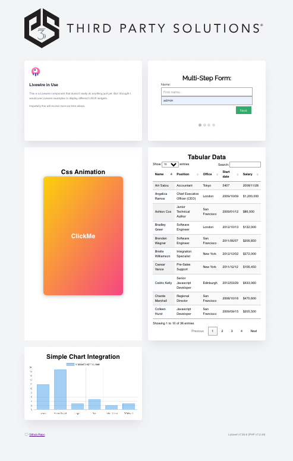

## Scott's Laravel 7 UI/UX Demo

This is a Laravel 7.3 installation running on PHP 7.2 in a docker container

- docker
- datatables
- google maps js api
- livewire
- javascript / css animations
- chart.js
- multi-step form

## Installation

Open a cli and navigate to the repo root. From there type:
`docker-compose up --build`

note: you should have docker instaled already. 

...and then ssh into the docker container

`docker exec -it scott-app /bin/bash`

Next, from inside the docker ssh shell, run  composer and npm 
`composer install`

`npm install`

OK, assuming nothing else is hijacking localhost, you should be able to navigate your browser to the app at http://localhost
## My Approach

I started by using composer to create a Laravel project, but found issues running Laravel because I 
wanted to preserve the requirement for Laravel 7, but my system was running php 8
(not compatible). So I chose to do a quick docker setup.

Once I had a running Laravel APP, I addded Livewire, since we had discussed it. I thought maybe 
it would be a good, simple blade extension to use. I didnt go to deep into LIvewire, though, 
because of time constraints.

Next, I thought about some UI/UX elements. I wanted to do a simple display of data, since its a common thing to
do on web apps. Tabular data is inescapable. I chose a pure Datatables implementation. Although, in a mature
Laravel and Vue/React ecosystem, I would have used those packages instead. Its a basic implementation and doesnt show the depth of
what this library can do, but, time constraints.

All widgets are wrapped in a Livewire container (blade). 

Regarding the Google Maps API...having some trouble getting google to not restrict
API calls from localhost. As time allows, I'll work further on this, however the code is
correct.

## Update

I dont think the google maps API is going to work out because of localhost referrer.

So, added a multi-step form with javascript management and a simple chart.js bar chart.

## Disclosures
- I didnt do much to architect js and css, with task runners (webpack, yarn, npm  etc). That would be my next step.
- When data was needed, I just hardcoded it. With more time, I would demonstrate the handoff of data
from the backend to the frontend, either with api endpoints (ajax), or
other dynamic param passing into livewire. The Welcome widget demonstrates the standard blade method of dynamic data. But my preference would
have been to call an api, return json, then use a js method to pass data into the widget.
- 
